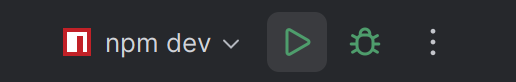

## How to work (FA)
 > Note: this is my way so it might be complicated, feel free to explore/share easier ways

1. install webstorm :) -- *JK any IDE will work*
2. open the **FRONTEND** folder only in webstorm, this is where you will edit FE related stuff
3. if this is ur first time running the project, open the terminal (ctrl+`) and run this command
```bash
npm install
## only use it for the first time!!
```
4. run the project using this button. alternatively, u can run `npm run dev` but for some reason i cant hot reload using it (might be a bug only for me)


> this is just the FE, Now going to the BE


1. open VS code or any IDE you like
2. open the root and type `go run main.go`
 plain and simple :)


## IMPORTANT
open the FE port! for me it's `http://localhost:5173/`


-----------

TODOs:
1. decide on how to org FE as folders (needs some research)
2. maybe consider stuff in the optional project
3. IMPORTANT: decide on design/colors/FE components
***better if it was in figma

-----------

## Nada's notes (new stuff)

### What was added

- Database status/privacy/type fields now use numbers instead of strings.
- The database change is in migration `000024`
- Frontend folders are now separated into pages, components, API functions, hooks, and styles.
- Routes were added for login, register, home, profile, groups, notifications, and chat.
- Login/register/home/logout are connected to the backend now.

### Before running the backend

If you have not applied the latest database migration yet, go into the `backend` folder and run:

```bash
migrate -path internal/db/migrations/sqlite -database "sqlite3://internal/db/social-network.db" up
```

Then start the backend from the `backend` folder:

```bash
go run ./cmd/server
```

It should run on `http://localhost:8080`.

### How to test the frontend routes

In another terminal, go into `Frontend` and run:

```bash
npm run dev
```

Then paste these into your browser:

- `http://localhost:5173/login`
- `http://localhost:5173/register`
- `http://localhost:5173/home`
- `http://localhost:5173/profile/user-123`
- `http://localhost:5173/groups`
- `http://localhost:5173/groups/group-456`
- `http://localhost:5173/notifications`
- `http://localhost:5173/chat`

The profile/group URLs with an ID are just testing the dynamic route. You can replace `user-123` or `group-456` with any text for now.

### How to test login/register

1. Go to `/register` and make an account.
2. It should send you to `/home` and show your name/email.
3. Refresh the page. You should still be logged in.
4. Click logout, then try logging in again at `/login`.

If you only want to test the backend, use `http://localhost:8080/test-auth`.
